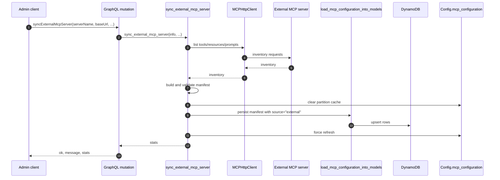
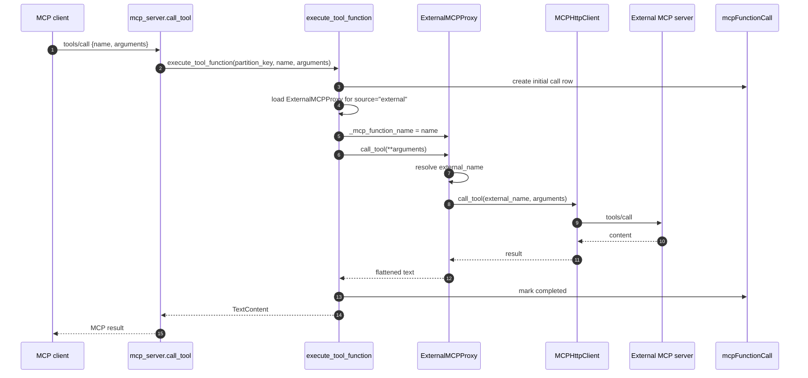

# External MCP Proxy Development Plan

> Status: Implemented, pending verification
> Document version: 1.6
> Last updated: 2026-06-04
> Owner: mcp-daemon-engine

## 1. Goal

`mcp_daemon_engine` can now register external HTTP MCP servers and proxy tool, resource, and prompt calls to them without uploading Python tool packages.

The external server inventory is stored in the existing catalog:

- `MCPFunction` rows for tools, resources, and prompts.
- One `MCPModule` row per external server.
- One `MCPSetting` row containing the external server connection settings.

Runtime execution reuses the existing dispatcher, audit logging, cache, gateway-delivered SSE/JSON-RPC transport, and GraphQL CRUD paths.

## 2. Current State

The external-proxy implementation is present, but live integration verification and tests are still pending.

| Area | Current state |
| ---- | ------------- |
| External client package | `mcp-http-client` is listed in `pyproject.toml`. The current code imports `MCPHttpClient` from `mcp_http_client`. |
| External sync mutation | `SyncExternalMcpServer` exists in `mcp_daemon_engine/mutations/mcp_external.py` and is registered in `mcp_daemon_engine/schema.py`; gateway GraphQL access is exposed through `main.py:dispatch_graphql`. |
| External sync handler | `mcp_daemon_engine/handlers/mcp_external.py` contains validation, inventory fetch, manifest translation, persistence, and cache refresh. |
| Built-in proxy adapter | `mcp_daemon_engine/handlers/external_mcp_proxy.py` contains `ExternalMCPProxy` with `call_tool`, `read_resource`, and `get_prompt`. |
| Dispatcher external source handling | `_get_module()` short-circuits when `source == "external"` and returns the built-in proxy module instead of using the S3 package path. |
| Tool name injection | `execute_tool_function()` sets `tool_obj._mcp_function_name = name` for external modules so a shared `call_tool` method can identify the local function. |
| Resource listing | `list_resources()` now fetches the config dict, extracts `resources` from it, and filters on truthy `uri`/`name`. Returns spec-compliant resources. |
| Prompt listing | The prompt filter now requires `name` instead of `inputSchema`, and the projection uses `prompt.get("description", "")` so prompts with no description don't raise `KeyError`. |
| Resource/prompt execution audit | `execute_decorator()` now extracts audit text through `_extract_audit_text()`, which handles tool list shapes (`[{"text": ...}]`), `ReadResourceResult` dumps (`{"contents": [{"text": ...}]}`), and `GetPromptResult` dumps (`{"messages": [{"content": {"text": ...}}]}`). Partitioned resource/prompt calls no longer fail during audit update. |
| Manifest loader | `load_mcp_configuration_into_models()` accepts an inline `mcp_configuration` dict and persists it without re-importing the module. |
| Manifest validation | `validate_manifest()` is reused for translated external manifests. |
| Cache behavior | Sync clears and warms the partition MCP configuration cache around persistence. |

## 3. Implemented Design

The implementation has two pieces.

Inventory sync:

`syncExternalMcpServer` connects to a remote HTTP MCP server, reads tools/resources/prompts through `MCPHttpClient`, translates the inventory into the same manifest shape used by package uploads, validates it, and writes rows through `load_mcp_configuration_into_models()`.

Proxy execution:

Rows synced from an external server use `source == "external"` and `class_name == "ExternalMCPProxy"`. During execution, `_get_module()` returns the built-in proxy module. The dispatcher instantiates `ExternalMCPProxy`, injects `_mcp_function_name` for tool calls, and invokes the configured method. The proxy opens `MCPHttpClient`, forwards the call to the remote server, and flattens the result for the existing dispatcher wrappers.

Context stamping is wired: `ExternalMCPProxy` predeclares `endpoint_id` and `part_id` as class attributes, so the dispatcher's `hasattr(tool_obj, "endpoint_id") and hasattr(tool_obj, "part_id")` guard fires on every instance. The proxy reassembles `partition_key` from those stamped values before calling `Config.fetch_mcp_configuration(...)` for `external_name` resolution.

## 4. Non-Goals

- New DynamoDB tables or model schema changes.
- Non-HTTP external transports such as stdio or WebSocket.
- Streaming partial external tool output back over SSE.
- Automatic scheduled re-sync.
- Secrets Manager/KMS integration. Credentials are stored in `MCPSetting` for now, matching the existing module-setting pattern.
- Automatic pruning of rows that disappear from upstream inventory.

## 5. Data Mapping

Each external server sync writes:

| Entity | Value |
| ------ | ----- |
| `MCPModule.module_name` | `serverName` |
| `MCPModule.package_name` | `serverName` |
| `MCPModule.source` | `"external"` |
| `MCPModule.classes[0].class_name` | `"ExternalMCPProxy"` |
| `MCPSetting.setting.base_url` | External MCP HTTP endpoint URL |
| `MCPSetting.setting.bearer_token` | Optional bearer token |
| `MCPSetting.setting.headers` | Optional extra headers |
| `MCPSetting.setting.name_prefix` | Optional local-name prefix |
| `MCPFunction.name` | Local function name, optionally prefixed |
| `MCPFunction.data.external_name` | Original upstream function name |
| `MCPFunction.module_name` | `serverName` |
| `MCPFunction.class_name` | `"ExternalMCPProxy"` |
| `MCPFunction.function_name` | `call_tool`, `read_resource`, or `get_prompt` |

No schema change is required because `MCPFunction.data` already preserves extra fields such as `external_name`, and `MCPSetting.setting` already stores arbitrary settings.

## 6. GraphQL API

Implemented mutation:

```graphql
type SyncExternalMcpServerPayload {
    ok: Boolean!
    message: String
    stats: McpConfigurationStats
}

extend type Mutation {
    syncExternalMcpServer(
        serverName: String!
        baseUrl: String!
        bearerToken: String
        headers: JSONCamelCase
        namePrefix: String
        updatedBy: String!
    ): SyncExternalMcpServerPayload
}
```

Arguments:

| Argument | Required | Description |
| -------- | -------- | ----------- |
| `serverName` | Yes | Local external-server identifier. Must match `^[A-Za-z][A-Za-z0-9_]*$`. |
| `baseUrl` | Yes | HTTP or HTTPS URL passed to `MCPHttpClient`. |
| `bearerToken` | No | Optional bearer token stored in the setting row and forwarded upstream. |
| `headers` | No | Optional extra HTTP headers stored in the setting row and forwarded upstream. |
| `namePrefix` | No | Optional prefix applied to local function names to avoid collisions. |
| `updatedBy` | Yes | Audit value written to all upserted rows. |

Registered in:

- `mcp_daemon_engine/mutations/mcp_external.py`
- `mcp_daemon_engine/schema.py`
- `mcp_daemon_engine/main.py`

## 7. Sync Handler

Implemented in `mcp_daemon_engine/handlers/mcp_external.py`.

Main flow:

1. Validate `server_name`.
2. Validate `base_url` starts with `http://` or `https://`.
3. Fetch external inventory with `MCPHttpClient`.
4. Translate inventory to the package-upload manifest shape.
5. Validate with `validate_manifest(..., module_name=server_name)`.
6. Clear the partition MCP configuration cache.
7. Persist with `load_mcp_configuration_into_models(..., source="external")`.
8. Warm the partition MCP configuration cache.
9. Return `McpConfigurationStats`.

The handler uses a private `_run_async()` helper to run async client calls from the sync GraphQL resolver. It mirrors the Lambda/non-Lambda pattern already used in `execute_tool_function()`.

Current `MCPHttpClient` assumptions used by the implementation:

- It is an async context manager.
- It exposes `list_tools()`, `list_resources()`, and `list_prompts()`.
- Inventory dataclasses expose snake_case fields such as `input_schema` and `mime_type`.
- `call_tool()` returns the upstream JSON-RPC `result.content` list.

## 8. Manifest Translation

The sync handler builds this manifest shape:

```python
{
    "tools": [...],
    "resources": [...],
    "prompts": [...],
    "module_links": [...],
    "modules": [
        {
            "module_name": server_name,
            "package_name": server_name,
            "class_name": "ExternalMCPProxy",
            "setting": {
                "base_url": "",
                "bearer_token": "",
                "headers": {},
                "name_prefix": "",
            },
            "source": "external",
        }
    ],
}
```

Tool translation:

```python
{
    "name": local_name,
    "description": tool.description,
    "inputSchema": tool.input_schema,
    "external_name": tool.name,
    "is_async": False,
}
```

Resource translation:

```python
{
    "name": local_name,
    "description": resource.description,
    "uri": resource.uri,
    "mimeType": resource.mime_type,
    "external_name": resource.name,
}
```

Prompt translation:

```python
{
    "name": local_name,
    "description": prompt.description,
    "arguments": prompt.arguments,
    "external_name": prompt.name,
}
```

`inputSchema` and `mimeType` intentionally use camelCase because the MCP SDK `Tool` and `Resource` constructors expect camelCase fields. Extra keys such as `external_name`, `uri`, `mimeType`, and `arguments` are stored in `MCPFunction.data` and later merged back into the cached config by `Config._build_function_config()`.

Module links:

| Type | `function_name` | `return_type` |
| ---- | --------------- | ------------- |
| Tool | `call_tool` | `text` |
| Resource | `read_resource` | `text` |
| Prompt | `get_prompt` | `text` |

The manifest declares empty connection-setting defaults. Real values are passed through `variables` because the existing loader only applies variable overrides to keys that already exist in the merged setting.

## 9. Name Collision Policy

`MCPFunction` is keyed by `(partition_key, name)`. If two external servers expose the same local name, the later sync can overwrite the earlier row.

Policy:

- `namePrefix` is optional and defaults to empty.
- If `namePrefix` is supplied, local names become `{namePrefix}{upstreamName}`.
- `external_name` always preserves the upstream name.
- The proxy uses `external_name` when forwarding tool and prompt calls.
- Resource URIs are not prefixed. Agents read resources by URI, and changing URI values would break upstream lookup semantics.

## 10. Proxy Adapter

Implemented in `mcp_daemon_engine/handlers/external_mcp_proxy.py`.

Construction contract:

```python
proxy = ExternalMCPProxy(Config.logger, **module["setting"])
```

Public methods:

```python
class ExternalMCPProxy:
    def call_tool(self, **arguments):
        ...

    def read_resource(self, uri: str):
        ...

    def get_prompt(self, name: str, **arguments):
        ...
```

Responsibilities:

- Store `base_url`, `bearer_token`, `headers`, and `name_prefix` from settings.
- Open `MCPHttpClient` per call inside an `async with` block.
- Map local tool/prompt names to upstream names via cached config `external_name`.
- Fall back to stripping `name_prefix` if `external_name` is missing.
- Flatten upstream tool content into a string for `return_type == "text"`.
- Flatten upstream resource and prompt results into values compatible with existing wrappers.

Partition-key reconstruction is wired through dispatcher stamping. `ExternalMCPProxy` declares `endpoint_id: str | None = None` and `part_id: str | None = None` at the class level, so the dispatcher's `hasattr(tool_obj, "endpoint_id") and hasattr(tool_obj, "part_id")` guard always passes and stamps the active partition values onto each instance. The proxy's `_partition_key()` recombines them as `f"{endpoint_id}#{part_id}"` (or just `endpoint_id` when `part_id` is `None`). Falling back to `"default"` only happens when neither value was ever stamped, which would indicate a dispatcher-side regression.

## 11. Dispatcher Changes

### 11.1 Module Loading

`_get_module()` now checks `source == "external"` before the S3 download branch:

```python
if source == "external":
    from . import external_mcp_proxy as module
    return module
```

This branch must stay before the existing truthy-`source` S3 path.

### 11.2 Tool Name Injection

All external tools share `function_name="call_tool"`, so the adapter needs the local function name.

`execute_tool_function()` now sets:

```python
if module.get("source") == "external":
    tool_obj._mcp_function_name = name
```

Resource and prompt calls do not need this injection:

- `execute_resource_function()` already calls `resource_function(uri)`.
- `execute_prompt_function()` already calls `prompt_function(name, **arguments)`.

## 12. MCP Listing Fixes

### 12.1 Resources

The previous code assigned `config` to the resource list and then guarded with `isinstance(config, dict)`, which was always false:

```python
config = get_mcp_configuration_with_retry(partition_key).get("resources", [])
if isinstance(config, dict) and "resources" in config:
    ...
return []
```

`list_resources()` now fetches the dict first, then extracts the list:

```python
config = get_mcp_configuration_with_retry(partition_key)
resources = config.get("resources", []) if isinstance(config, dict) else []
return [
    Resource(**resource)
    for resource in resources
    if isinstance(resource, dict)
    and resource.get("uri")
    and resource.get("name")
]
```

### 12.2 Prompts

The prompt filter requires `name` instead of `inputSchema`, matching the MCP prompt shape. The projection uses `prompt.get("description", "")` so prompts whose upstream inventory omits `description` no longer raise `KeyError`.

### 12.3 Resource and Prompt Audit Update

`execute_decorator()` previously wrote audit content with `content[0]["text"]`, which only matches tool execution's list-of-dicts shape. Resource and prompt executors return `ReadResourceResult` and `GetPromptResult`; their `model_dump()` produces dicts (`{"contents": [...]}` and `{"messages": [...]}` respectively), so the same access pattern crashed during audit update.

The decorator now routes through `_extract_audit_text(content)` (in `handlers/mcp_utility.py`), which dispatches on shape:

- `list` with dict items → first `text` field, falling back to JSON-dumping the first item.
- `dict` with `contents` → first content's `text`.
- `dict` with `messages` → first message's `content.text`.
- Anything else → `str(content)` or JSON dump.

Tool execution still extracts `content[0].get("text")`, so the existing tool audit behavior is unchanged. Resource and prompt audit rows now complete cleanly for both local and external adapters.

## 13. File Change Summary

| File | Change | Status |
| ---- | ------ | ------ |
| `pyproject.toml` | Add `mcp-http-client` and `aiohttp`. | Done |
| `mcp_daemon_engine/handlers/mcp_external.py` | New sync handler and manifest translation helpers. | Done |
| `mcp_daemon_engine/handlers/external_mcp_proxy.py` | New adapter used by runtime dispatch. | Done |
| `mcp_daemon_engine/mutations/mcp_external.py` | New `SyncExternalMcpServer` mutation. | Done |
| `mcp_daemon_engine/schema.py` | Register the mutation. | Done |
| `mcp_daemon_engine/main.py` | Expose gateway GraphQL dispatch for `syncExternalMcpServer`. | Done |
| `mcp_daemon_engine/handlers/mcp_utility.py` | Add `source == "external"` module short-circuit and tool-name injection. | Done |
| `mcp_daemon_engine/handlers/mcp_server.py` | Fix prompt filter, resource filter, and prompt description hardening. | Done |
| `mcp_daemon_engine/handlers/mcp_utility.py` | External module loading, tool-name injection, and `_extract_audit_text()` for resource/prompt audit serialization. | Done |
| `mcp_daemon_engine/handlers/external_mcp_proxy.py` | Predeclare `endpoint_id`/`part_id` class attributes so dispatcher stamping fires. | Done |
| `AGENTS.md` | Document `source == "external"` and the sync mutation. | Done |

## 14. Sync Sequence



## 15. Tool Execution Sequence



## 16. Acceptance Status

Sync:

- Done: `syncExternalMcpServer` appears in the GraphQL schema and is reachable through the gateway GraphQL dispatch path.
- Pending verification: syncing a mock HTTP MCP server writes expected function/module/setting rows.
- Pending verification: synced rows use `source == "external"` and `className == "ExternalMCPProxy"`.
- Pending verification: re-running sync updates existing rows and refreshes the partition cache.
- Pending verification: connection failures return `ok: false` and do not write partial inventory.

Proxy execution:

- Pending verification: a synced tool forwards to the upstream MCP server.
- Pending verification: prompt and resource calls work through the same adapter.
- Pending verification: `namePrefix` changes local names but outbound calls use upstream `external_name`.
- Done: tool/resource/prompt `mcpFunctionCall` rows complete cleanly through the shape-aware `_extract_audit_text()` helper.
- Done: prompt and resource listings both return spec-compliant entries.
- Done: partition-specific external-name lookup works because `ExternalMCPProxy` predeclares `endpoint_id`/`part_id` so dispatcher stamping fires.
- Pending verification: all of the above against a real upstream MCP server.

## 17. Test Plan

No external-proxy tests are currently implemented. The repository has an integration-oriented unittest module but no CI/test-runner configuration.

Recommended tests:

| Test | Target |
| ---- | ------ |
| Validate external server name | Accept `WeatherCo`; reject empty, starts-with-digit, hyphenated, or whitespace names. |
| Validate base URL | Accept `http://` and `https://`; reject missing scheme or unsupported schemes. |
| Build manifest | Verify tools/resources/prompts, `external_name`, module links, and setting defaults. |
| Sync happy path | Mock `MCPHttpClient` inventory and `load_mcp_configuration_into_models`; assert stats and cache calls. |
| Sync connection failure | Mock client failure; assert loader is not called. |
| External module short-circuit | `_get_module(..., source="external")` returns the built-in proxy module and does not touch S3. |
| Proxy tool call | Mock client `call_tool`; assert upstream name and arguments are forwarded. |
| Name mapping | Cached config maps prefixed local names back to `external_name`. |
| Resource/prompt listing | Spec-compliant resources/prompts without `inputSchema` are listed after Section 12.1 lands. |
| GraphQL registration | Schema exposes `syncExternalMcpServer`. |

## 18. Open Follow-Ups

- Add the tests listed in Section 17.
- Verify the external client package name and dependency story for release. `pyproject.toml` currently lists both `mcp-http-client` and `aiohttp`.
- Decide whether external credentials need KMS/Secrets Manager before production use.
- Evaluate connection pooling for high-frequency external calls. The current adapter opens a client per call.
- Consider forwarding partition metadata to upstream through configurable headers.
- Consider scheduled re-sync or webhook-triggered re-sync.
- Consider async-by-default external tools for slow upstream calls.
- Decide whether sync should prune local rows that disappeared from upstream inventory.

## 19. Reference Map

- `mcp_daemon_engine/handlers/mcp_handlers.py`: manifest validation and model-loading sink.
- `mcp_daemon_engine/handlers/mcp_external.py`: external sync handler and manifest translation.
- `mcp_daemon_engine/handlers/external_mcp_proxy.py`: built-in proxy adapter class.
- `mcp_daemon_engine/handlers/mcp_utility.py`: runtime dispatch, dynamic module loading, and audit decorator.
- `mcp_daemon_engine/handlers/mcp_server.py`: MCP list/call/read/get endpoints.
- `mcp_daemon_engine/handlers/config.py`: configuration cache, model fetch assembly, AWS clients.
- `mcp_daemon_engine/schema.py`: Graphene schema registration.
- `mcp_daemon_engine/main.py`: Gateway dispatch functions and partition-key setup.
- `mcp_daemon_engine/mutations/mcp_external.py`: `SyncExternalMcpServer` GraphQL mutation.
- `mcp_daemon_engine/models/mcp_function.py`: function row upsert behavior.
- `mcp_daemon_engine/models/mcp_module.py`: module row upsert behavior.
- `mcp_daemon_engine/models/mcp_setting.py`: setting row upsert behavior.
