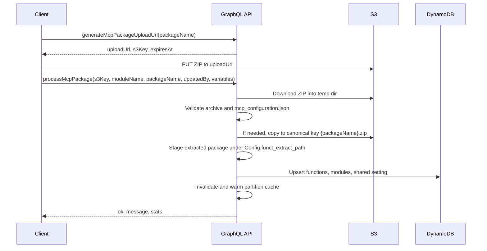

# MCP Package Upload and Configuration Load Specification

> Status: Design ready
> Last updated: 2026-05-19
> Document version: 4.1

## 1. Executive Summary

This document specifies a GraphQL-driven workflow for shipping a Python MCP package to the daemon. The flow has three steps:

1. The client asks the daemon for a short-lived S3 presigned PUT URL.
2. The client uploads `{packageName}.zip` directly to S3.
3. The client calls a GraphQL mutation that downloads the object, validates the archive and its `mcp_configuration.json` manifest, stages the package on local disk, and persists the manifest into DynamoDB via the existing model loader.

The design keeps binary bytes out of GraphQL requests, reuses today's runtime S3 key convention, and remains idempotent under repeated uploads. The existing runtime in `mcp_daemon_engine/handlers/mcp_utility.py` is untouched.

## 2. Purpose and Motivation

The project already supports two pieces of this workflow independently:

- Runtime S3 lookup: when a tool is invoked and the package is not present on disk, `_download_and_extract_package(package_name)` pulls `s3://{Config.funct_bucket_name}/{package_name}.zip` and extracts it under `Config.funct_extract_path`.
- Configuration persistence: `load_mcp_configuration_into_models()` upserts function, module, and setting rows from a manifest dictionary, either supplied inline or read from `module.MCP_CONFIGURATION` after import.

Today an operator must coordinate these manually: upload the ZIP to S3, then call `loadMcpConfiguration` with either inline configuration or `moduleName` (which triggers an import to read `MCP_CONFIGURATION`). There is no manifest-level validation before database writes, no presigned upload mechanism, and no enforced contract between the ZIP layout and the manifest references.

This specification turns those pieces into a single coordinated, validated upload-and-load flow while preserving the existing runtime behavior.

## 3. Current Implementation Baseline

The feature must build on these behaviors as they exist in the repository today:

| Area | Current behavior |
| ---- | ---------------- |
| Runtime ZIP lookup | `_download_and_extract_package(package_name)` in `handlers/mcp_utility.py` downloads `s3://{Config.funct_bucket_name}/{package_name}.zip` to `Config.funct_zip_path` and extracts it into `Config.funct_extract_path`. |
| Local existence check | `_module_exists(module_name)` only returns `True` for a **directory** at `{Config.funct_extract_path}/{module_name}`. Single-file modules pass `__import__` but fail this check, so the daemon re-downloads on every invocation. |
| Python import path | `_get_module()` appends `Config.funct_extract_path` to `sys.path` and calls `__import__(module_name)`. The archive must expose an importable top-level package or module matching `module_name`. |
| Configuration loading | `load_mcp_configuration_into_models()` in `handlers/mcp_handlers.py` upserts `MCPFunction`, `MCPModule`, and `MCPSetting` rows from either an inline manifest or the result of `get_mcp_configuration_by_module()`. |
| Settings precedence | All module settings are merged into one shared `MCPSetting`. `Config.setting` overrides matching keys; request-level `variables` override matching keys last. |
| Partitioning | All writes use `info.context["partition_key"]`, derived from `endpoint_id` and optional `part_id` by `AIMCPDaemonEngine._apply_partition_defaults()` in `main.py`. |
| Configuration cache | `Config.fetch_mcp_configuration(partition_key)` caches assembled configs in an in-memory `Config.mcp_configuration` dict. There is no TTL: entries persist until `Config.clear_mcp_configuration_cache(partition_key)` is called or the process restarts. |
| Existing GraphQL surface | `LoadMcpConfiguration` (registered in `handlers/schema.py`) exists. Presigned upload URL generation and package processing mutations do not. |

## 4. Design Goals

- Keep binary package bytes out of GraphQL requests by default.
- Reuse the same Graphene schema and resolvers from both FastAPI SSE mode and SilvaEngine Lambda mode.
- Preserve the runtime S3 key convention: `{packageName}.zip`.
- Validate ZIP structure and manifest references **before** any DynamoDB writes.
- Make repeated uploads idempotent — model upserts are keyed by `partition_key`, function `name`, and `module_name`.
- Leave deletion of removed functions explicit; do not delete rows just because a new manifest omits them.

## 5. Non-Goals

- Package versioning (no version field on the ZIP or in the manifest).
- Dependency installation from `requirements.txt`.
- Sandboxing of uploaded Python code — packages execute in the daemon process.
- Automatic pruning of DynamoDB rows that a newer manifest no longer references.
- A REST multipart upload endpoint.

## 6. Proposed Workflow



The client uploads directly to S3 with a presigned PUT URL. The daemon then downloads the uploaded object, validates it in an isolated temp directory, normalizes the storage location to the canonical runtime key, extracts the package onto local disk so subsequent imports succeed in-process, persists the manifest, and refreshes the partition cache. No DynamoDB writes happen until validation passes.

## 7. GraphQL API

### 7.1 `generateMcpPackageUploadUrl`

Returns a short-lived S3 presigned PUT URL.

```graphql
type GenerateMcpPackageUploadUrlPayload {
    ok: Boolean!
    message: String
    uploadUrl: String
    s3Key: String
    expiresAt: DateTime
}

extend type Mutation {
    generateMcpPackageUploadUrl(
        packageName: String!
    ): GenerateMcpPackageUploadUrlPayload
}
```

| Argument | Required | Description |
| -------- | -------- | ----------- |
| `packageName` | Yes | Logical package name. The canonical runtime object key is `{packageName}.zip`. |

Resolver requirements:

- Reject empty names, path separators, `..`, and any name failing the package-name policy (see §11).
- Call `Config.aws_s3.generate_presigned_url("put_object", ...)`.
- Use bucket `Config.funct_bucket_name` and key `{packageName}.zip`. (A future staging-key design may decouple these; the first implementation uses the canonical key directly.)
- Include `ContentType: application/zip` in the presigned request parameters so the client must PUT with the matching `Content-Type` header.
- Default expiration: 900 seconds. Make this overridable via `Config.setting` only if operators need it.

Example response:

```json
{
  "data": {
    "generateMcpPackageUploadUrl": {
      "ok": true,
      "message": null,
      "uploadUrl": "https://bucket.s3.amazonaws.com/weather_tools.zip?...",
      "s3Key": "weather_tools.zip",
      "expiresAt": "2026-05-19T20:30:00Z"
    }
  }
}
```

### 7.2 `processMcpPackage`

Validates an uploaded ZIP, stages it, and persists the manifest.

```graphql
type McpPackageLoadStats {
    tools: Int
    resources: Int
    prompts: Int
    modules: Int
    settings: Int
}

type ProcessMcpPackagePayload {
    ok: Boolean!
    message: String
    stats: McpPackageLoadStats
}

extend type Mutation {
    processMcpPackage(
        s3Key: String!
        moduleName: String!
        packageName: String!
        source: String
        variables: JSONCamelCase
        updatedBy: String!
    ): ProcessMcpPackagePayload
}
```

| Argument | Required | Description |
| -------- | -------- | ----------- |
| `s3Key` | Yes | Object key of the uploaded ZIP. Usually `{packageName}.zip`; allowed to differ to support a future staging-key flow. |
| `moduleName` | Yes | Python import name the archive must expose at its root. |
| `packageName` | Yes | Logical package identifier; also the canonical runtime S3 key prefix. |
| `source` | No | Stored on `MCPModule.source`. Default `"s3"` for uploaded packages. Pass an empty string for in-process modules that should never trigger an S3 download at runtime. |
| `variables` | No | Setting overrides forwarded to `load_mcp_configuration_into_models()`. Highest precedence over module-defined defaults and `Config.setting`. |
| `updatedBy` | Yes | Audit identifier written to every upserted row. |

Processing sequence:

1. Resolve `partition_key` from `info.context["partition_key"]`.
2. Download `s3Key` from `Config.funct_bucket_name` into a freshly created temp directory unique to this request.
3. Pre-extraction validation:
   - Object is a valid ZIP archive.
   - No member name is absolute (`/foo`) or contains `..` segments.
   - `mcp_configuration.json` exists at the archive root.
4. Extract into a temp validation directory (still isolated from `Config.funct_extract_path`).
5. Parse and validate `mcp_configuration.json` against the rules in §9.
6. Verify the extracted tree exposes `moduleName` as an importable root:
   - Directory form: `{moduleName}/__init__.py`, or
   - Single-file form: `{moduleName}.py`.

   Note: even though Python can import the single-file form, the runtime existence check (`_module_exists()`) only succeeds for directories. Single-file packages currently work but re-download on every invocation. Prefer the directory form unless this caveat is acceptable.
7. If `s3Key != "{packageName}.zip"`, copy the object to the canonical key. If the upload URL already used the canonical key, this is a no-op.
8. Copy or extract the package contents into `Config.funct_extract_path` so the next import in the current process resolves locally without re-downloading.
9. Call `load_mcp_configuration_into_models()` with the parsed manifest, `variables`, `updated_by`, and `source`.
10. Call `Config.clear_mcp_configuration_cache(partition_key)`, then attempt `Config.fetch_mcp_configuration(partition_key, force_refresh=True)` to warm the cache.
11. Remove the temp directory regardless of outcome.

The mutation returns `ok: false` for validation or download failures and performs **no** database writes in those cases. Once writes begin, retries are safe: model upserts are keyed on `(partition_key, name)` or `(partition_key, module_name)` and are idempotent.

## 8. ZIP Package Format

Recommended layout (directory form):

```text
weather_tools.zip
|-- mcp_configuration.json
|-- weather_tools/
|   |-- __init__.py
|   |-- weather_tool.py
|   `-- helpers.py
`-- requirements.txt
```

`requirements.txt` is optional and informational only. The daemon does not install dependencies during package processing or runtime execution; any third-party imports must already be available in the daemon's Python environment.

The runtime resolves classes with:

```python
module = __import__(module_name)
tool_class = getattr(module, class_name)
```

So the imported module must export every class name referenced by `module_links[*].class_name`.

## 9. Manifest Schema

`mcp_configuration.json` matches the structure consumed by `load_mcp_configuration_into_models()`:

```json
{
  "tools": [
    {
      "name": "weather_lookup",
      "description": "Look up weather by city",
      "inputSchema": {
        "type": "object",
        "properties": {
          "city": { "type": "string" }
        },
        "required": ["city"]
      },
      "is_async": false
    }
  ],
  "resources": [],
  "prompts": [],
  "module_links": [
    {
      "type": "tool",
      "name": "weather_lookup",
      "module_name": "weather_tools",
      "class_name": "WeatherTool",
      "function_name": "get_weather",
      "return_type": "text",
      "is_async": false
    }
  ],
  "modules": [
    {
      "module_name": "weather_tools",
      "package_name": "weather_tools",
      "class_name": "WeatherTool",
      "setting": {
        "api_key": "",
        "base_url": "https://api.example.com"
      },
      "source": "s3"
    }
  ]
}
```

Validation rules:

| # | Rule |
| - | ---- |
| 1 | Manifest must be a valid JSON object. |
| 2 | At least one of `tools`, `resources`, or `prompts` must be present and non-empty. (A manifest with only `modules` cannot be wired to anything callable.) |
| 3 | Every function entry must have a non-empty `name`. |
| 4 | Every `module_links[*].name` must reference a function declared in `tools`, `resources`, or `prompts` with the **same** `type`. |
| 5 | Every `module_links[*].module_name`, `class_name`, and `function_name` must be non-empty. |
| 6 | Every linked `module_name` must have a matching `modules[*].module_name`. |
| 7 | Every `modules[*].module_name` must equal the `moduleName` mutation argument. (A future multi-module rule may relax this; the first implementation requires equality.) |
| 8 | `return_type` should be one of `text`, `image`, or `embedded_resource`; default to `text` when omitted. |
| 9 | `source` defaults to `"s3"` for uploaded packages. |

**Casing note.** GraphQL clients use camelCase mutation arguments, but the JSON manifest is consumed by Python code as-is. The loader expects snake_case keys such as `module_links`, `module_name`, `class_name`, `function_name`, `return_type`, and `is_async` — do not camelCase keys inside `mcp_configuration.json`.

## 10. Base64 Inline Option

A development shortcut for very small packages may extend the existing `loadMcpConfiguration` mutation with a `packageBase64` argument.

```graphql
extend type Mutation {
    loadMcpConfiguration(
        packageBase64: String
        packageName: String
        moduleName: String
        source: String
        mcpConfiguration: JSONCamelCase
        variables: JSONCamelCase
        updatedBy: String!
    ): LoadMcpConfigurationPayload
}
```

Dispatch order inside `LoadMcpConfiguration.mutate()`:

1. If `packageBase64` is set, decode bytes; reject payloads above a conservative raw-ZIP size limit; upload to `s3://{Config.funct_bucket_name}/{packageName}.zip`; then run the same ZIP and manifest validation as `processMcpPackage`.
2. Else if `mcpConfiguration` is set, load it directly via `load_mcp_configuration_into_models()` (the path used today).
3. Else if `moduleName` is set, import the module and read `MCP_CONFIGURATION` (the path used today).
4. Otherwise return `ok: false` with a "no configuration source provided" message.

API Gateway has a 10 MB request limit, and Base64 adds ~33 percent overhead. Use this path only for small dev/test packages; production uploads should always go through the presigned URL flow.

## 11. Code Changes

| File | Change |
| ---- | ------ |
| `mcp_daemon_engine/mutations/mcp_upload.py` (new) | Add `GenerateMcpPackageUploadUrl`, `ProcessMcpPackage`, and the stats payload type. |
| `mcp_daemon_engine/handlers/mcp_handlers.py` | Add package-name validation, ZIP download/extraction helpers, manifest validation, package processing orchestration, and cache refresh. Reuse `load_mcp_configuration_into_models()`. |
| `mcp_daemon_engine/mutations/mcp_configuration.py` | Optionally add `package_base64` / `packageBase64` dispatch as described in §10. |
| `mcp_daemon_engine/handlers/schema.py` | Import and register the new mutations on `Mutations`. |
| `mcp_daemon_engine/main.py` | Extend the `deploy()` GraphQL action manifest. Also surface the existing `loadMcpConfiguration` and module/setting CRUD actions that are currently omitted. |
| `mcp_daemon_engine/handlers/mcp_utility.py` | No required change. Existing S3 download/import behavior remains compatible. (Optional follow-up: make `_module_exists()` also accept `{module_name}.py` for single-file modules.) |
| `mcp_daemon_engine/handlers/config.py` | No required change unless upload URL TTL or package size limits become operator-configurable settings. |

**Package-name policy** (used by both mutations and any helper):

- Must match `^[A-Za-z][A-Za-z0-9_]*$`.
- Reject names containing path separators (`/`, `\`), `..`, whitespace, or any character outside the regex above.
- Reject empty strings.

Suggested `deploy()` additions:

```python
{"action": "loadMcpConfiguration",          "label": "Load MCP Configuration"},
{"action": "generateMcpPackageUploadUrl",   "label": "Generate MCP Package Upload URL"},
{"action": "processMcpPackage",             "label": "Process MCP Package"},
{"action": "insertUpdateMcpModule",         "label": "Create Update MCP Module"},
{"action": "deleteMcpModule",               "label": "Delete MCP Module"},
{"action": "insertUpdateMcpSetting",        "label": "Create Update MCP Setting"},
{"action": "deleteMcpSetting",              "label": "Delete MCP Setting"},
```

## 12. Error Handling

| Failure | Response | Side effects |
| ------- | -------- | ------------ |
| Invalid package name | `ok: false`, validation message | None |
| Presign failure | `ok: false`, S3 error summary | None |
| Client upload failure | Client receives the S3 error directly | No daemon involvement |
| Missing S3 object | `ok: false`, download failure message | None |
| Invalid ZIP file | `ok: false`, validation message | No DB writes |
| Unsafe ZIP path (absolute or `..`) | `ok: false`, validation message | No DB writes |
| Missing `mcp_configuration.json` | `ok: false`, validation message | No DB writes |
| Invalid manifest references (rules 2–7 in §9) | `ok: false`, validation message | No DB writes |
| Missing importable root for `moduleName` | `ok: false`, validation message | No DB writes |
| DynamoDB write failure | `ok: false`, load failure message | Partial idempotent upserts may exist; safe to re-run the same mutation. |
| Cache refresh failure after successful DB writes | `ok: true`, message notes cache refresh failure | DB writes persisted; cache is invalidated and will be rebuilt on next read. |
| Temp directory cleanup failure | Logged but does not change the response | Temp files may linger; operators should size `/tmp` accordingly. |

When `ok` is `true`, `stats` must be populated. When `ok` is `false`, `message` must contain an operator-actionable reason.

## 13. Security Considerations

- Presigned URLs are scoped to a single object key and PUT only. Do not grant `s3:GetObject` or `s3:DeleteObject` through these URLs.
- Sanitize `packageName` before using it as an S3 key or filesystem path; reject anything failing the policy in §11.
- ZIP extraction must reject absolute paths and `..` traversal **before** writing any file to disk, even into the temp directory.
- Uploaded Python code runs in the daemon process with the daemon's full privileges. Restrict upload/process mutations to trusted administrators.
- The current `deploy()` manifest marks `mcp_core_graphql` as `is_auth_required: False`. Transport-level protection differs between FastAPI middleware (`FlexJWTMiddleware`) and SilvaEngine Lambda deployments. Add explicit authorization checks on upload/process mutations whenever deployment auth cannot guarantee admin-only access.
- For production, also consider: S3 bucket policies restricting principals, server-side encryption (SSE-KMS or SSE-S3), maximum object size limits enforced on the bucket, and CloudTrail object-level logging.

## 14. Testing Notes

The repository currently has no configured test runner or active test suite. When tests are introduced, start with pure-helper coverage and keep AWS interactions mocked (e.g., `moto` for S3, `botocore.stub.Stubber`, or thin in-process fakes).

Recommended scenarios:

| Scenario | Expected result |
| -------- | --------------- |
| Generate upload URL | Returns `{packageName}.zip` and calls S3 presign with `put_object`. |
| Invalid package name | Rejects path separators, `..`, empty strings, and policy violations. |
| Valid package process | Loads functions/modules/settings and refreshes the partition cache. |
| Missing manifest | Fails before DB writes. |
| Unsafe ZIP path | Fails before any file is written outside the temp directory. |
| Broken module link (rules 4–7) | Fails before DB writes with a message naming the offending entry. |
| Idempotent reprocess | Second run updates existing rows; no duplicate function or module keys. |
| Cache refresh failure after successful writes | Returns `ok: true` with a warning. |
| Base64 small package | Uploads to canonical S3 key and follows the same validation path. |
| Single-file module package | Loads successfully; doc notes that `_module_exists()` will miss it at runtime. |

## 15. Implementation Order

1. Add package-name and ZIP validation helpers.
2. Add manifest validation helper.
3. Add `process_mcp_package()` handler that downloads, validates, stages, loads, and refreshes the cache.
4. Add `generate_upload_url()` handler.
5. Add the two GraphQL mutation classes and register them in `handlers/schema.py`.
6. Update the `deploy()` action manifest in `main.py`.
7. (Optional) Extend `loadMcpConfiguration` with `packageBase64` and the dispatch logic from §10.
8. Add focused tests or manual validation scripts.

## 16. References

| Source | Relevance |
| ------ | --------- |
| `mcp_daemon_engine/handlers/mcp_handlers.py` | `load_mcp_configuration_into_models()` — persistence path reused by both mutations. |
| `mcp_daemon_engine/handlers/mcp_utility.py` | Runtime S3 download, extraction, import, and execution. Contains `_module_exists()`, `_download_and_extract_package()`, `_get_module()`. |
| `mcp_daemon_engine/handlers/config.py` | S3 client, function paths, in-memory configuration cache, and partition handling. |
| `mcp_daemon_engine/mutations/mcp_configuration.py` | Existing `LoadMcpConfiguration` mutation and dispatch site for the Base64 option. |
| `mcp_daemon_engine/handlers/schema.py` | Graphene `Query`/`Mutations` registration. |
| `mcp_daemon_engine/main.py` | SilvaEngine `deploy()` action manifest and partition key derivation. |
| `mcp_daemon_engine/models/mcp_function.py` | DynamoDB function model and idempotent upsert behavior. |
| `mcp_daemon_engine/models/mcp_module.py` | DynamoDB module model and `package_name-index` LSI. |
| `mcp_daemon_engine/models/mcp_setting.py` | DynamoDB setting model. |
